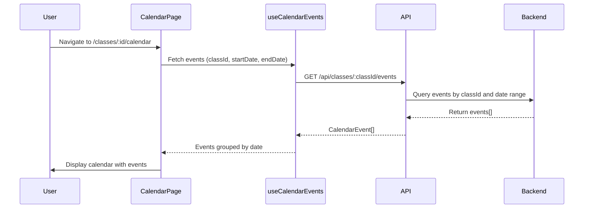
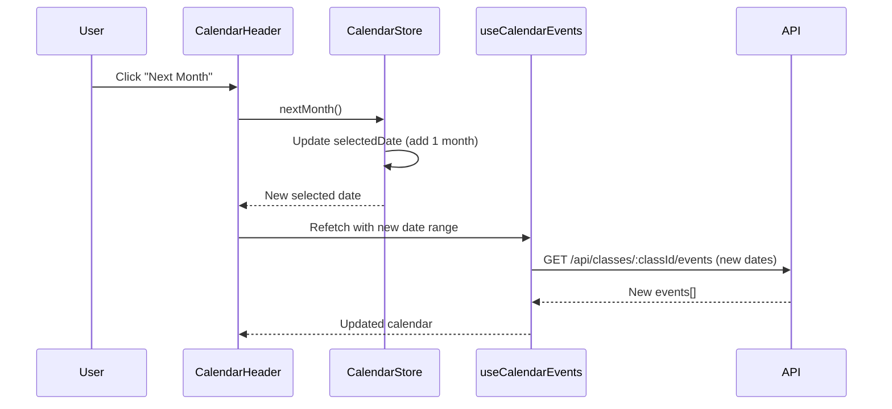

# Data Model: Class Calendar

**Feature**: 003-class-calendar  
**Date**: October 30, 2025  
**Status**: Complete

## Overview

This document defines the data entities for the Class Calendar feature. The calendar displays events associated with a specific class, with support for categorization, date/time information, and optional details.

## Core Entities

### CalendarEvent

Represents a scheduled activity or deadline for a class.

```typescript
interface CalendarEvent {
  id: string;                    // Unique identifier (UUID)
  classId: string;               // Foreign key to Class entity
  name: string;                  // Event title (e.g., "Book Report Due", "Field Trip")
  date: string;                  // ISO 8601 date (YYYY-MM-DD)
  startTime?: string;            // Optional ISO 8601 time (HH:mm:ss)
  endTime?: string;              // Optional ISO 8601 time (HH:mm:ss)
  category: EventCategory;       // Event type for visual distinction
  location?: string;             // Optional physical location
  description?: string;          // Optional detailed description
  createdAt: string;             // ISO 8601 timestamp
  updatedAt: string;             // ISO 8601 timestamp
}
```

**Field Descriptions**:

- `id`: Unique identifier for the event. Generated server-side.
- `classId`: Links event to specific class. Used for filtering events by class.
- `name`: Display name shown on calendar. Must be concise (max 100 characters recommended).
- `date`: Event date in YYYY-MM-DD format. Used for calendar placement.
- `startTime` / `endTime`: Optional time range for events with specific scheduling (e.g., "Field Trip: 8:00 AM - 3:00 PM").
- `category`: Enum value for visual categorization (see EventCategory below).
- `location`: Optional physical location (e.g., "Room 301", "City Museum").
- `description`: Optional long-form details. Displayed in event details dialog.
- `createdAt` / `updatedAt`: Audit timestamps.

**Validation Rules**:
- `name`: Required, 1-100 characters
- `date`: Required, valid ISO 8601 date
- `startTime` / `endTime`: If provided, must be valid ISO 8601 time; endTime must be after startTime
- `category`: Required, must be valid EventCategory enum value
- `location`: Optional, max 200 characters
- `description`: Optional, max 2000 characters

**Relationships**:
- `CalendarEvent.classId` → `Class.id` (Many-to-One)
- Events belong to one class; a class can have many events

### EventCategory

Enum defining event types for visual distinction and potential filtering.

```typescript
enum EventCategory {
  ASSIGNMENT = 'assignment',       // Homework, projects, reports due
  EXAM = 'exam',                   // Tests, quizzes, assessments
  FIELD_TRIP = 'fieldTrip',        // Off-campus educational trips
  MEETING = 'meeting',             // Parent-teacher meetings, conferences
  HOLIDAY = 'holiday',             // School holidays, breaks
  PRESENTATION = 'presentation',   // Student presentations, demos
  OTHER = 'other'                  // Miscellaneous events
}
```

**Category Color Mapping** (for UI reference):
- `ASSIGNMENT`: Blue (#3B82F6)
- `EXAM`: Red (#EF4444)
- `FIELD_TRIP`: Green (#10B981)
- `MEETING`: Purple (#8B5CF6)
- `HOLIDAY`: Orange (#F59E0B)
- `PRESENTATION`: Pink (#EC4899)
- `OTHER`: Gray (#6B7280)

**Usage**: Category determines badge color in calendar cells and can be used for future filtering functionality.

## Supporting Entities

### Class (Reference)

The calendar displays events for a specific class. The Class entity is defined in the existing classes module (`features/classes/types/entities/class.ts`).

**Relevant Fields for Calendar**:
```typescript
interface Class {
  id: string;
  name: string;              // Display in calendar header (e.g., "Class 10A1")
  academicYear: string;      // Context for event date ranges
  homeroomTeacher?: Teacher; // Current user (permission check)
  // ... other fields from class entity
}
```

**Integration**: Calendar page receives `classId` from route params (`/classes/:id/calendar`) and fetches events for that class.

## Derived Data Structures

### EventsByDate (UI State)

Calendar UI groups events by date for efficient rendering.

```typescript
type EventsByDate = Map<string, CalendarEvent[]>;
// Key: ISO date string (YYYY-MM-DD)
// Value: Array of events for that date, sorted by startTime (if present)
```

**Creation Logic**:
```typescript
function groupEventsByDate(events: CalendarEvent[]): EventsByDate {
  return events.reduce((acc, event) => {
    const dateKey = event.date;
    if (!acc.has(dateKey)) {
      acc.set(dateKey, []);
    }
    acc.get(dateKey)!.push(event);
    return acc;
  }, new Map<string, CalendarEvent[]>());
}
```

**Usage**: Passed to calendar day cells to render events efficiently. Day cell receives `events={eventsByDate.get(dateKey) ?? []}`.

### CalendarMonth (UI State)

Represents the currently displayed month in the calendar.

```typescript
interface CalendarMonth {
  year: number;              // e.g., 2025
  month: number;             // 0-11 (JavaScript Date month)
  startDate: Date;           // First day of month (for API queries)
  endDate: Date;             // Last day of month (for API queries)
}
```

**Usage**: Stored in Zustand store, passed to API hooks for fetching events within date range.

## State Transitions

### Event Lifecycle (Read-Only Feature)

For this read-only calendar feature, events do not have state transitions within the calendar. Event lifecycle (creation, updates, deletion) is managed in a separate feature.

**Relevant States for Display**:
1. **Upcoming**: Event date is in the future
2. **Today**: Event date is current day
3. **Past**: Event date has passed

**Visual Distinction**:
- **Upcoming / Today**: Full opacity, normal styling
- **Past**: Reduced opacity (opacity-60) to de-emphasize

## Data Flow

### Loading Events



### Month Navigation



## Mock Data

Sample events for initial development and testing:

```typescript
const mockEvents: CalendarEvent[] = [
  {
    id: 'event-001',
    classId: 'class-123',
    name: 'Book Report Due',
    date: '2025-10-20',
    startTime: null,
    endTime: null,
    category: EventCategory.ASSIGNMENT,
    location: null,
    description: 'Submit book report on assigned reading',
    createdAt: '2025-09-01T10:00:00Z',
    updatedAt: '2025-09-01T10:00:00Z'
  },
  {
    id: 'event-002',
    classId: 'class-123',
    name: 'Field Trip',
    date: '2025-10-25',
    startTime: '08:00:00',
    endTime: '15:00:00',
    category: EventCategory.FIELD_TRIP,
    location: 'City Science Museum',
    description: 'Educational trip to explore science exhibits',
    createdAt: '2025-09-15T14:30:00Z',
    updatedAt: '2025-09-15T14:30:00Z'
  },
  {
    id: 'event-003',
    classId: 'class-123',
    name: 'Math Quiz',
    date: '2025-10-15',
    startTime: '09:00:00',
    endTime: '10:00:00',
    category: EventCategory.EXAM,
    location: 'Room 301',
    description: 'Chapter 5 algebra quiz',
    createdAt: '2025-09-20T11:00:00Z',
    updatedAt: '2025-09-20T11:00:00Z'
  }
];
```

## Database Schema (Reference)

While this feature is frontend-only, the expected backend schema:

```sql
CREATE TABLE calendar_events (
  id UUID PRIMARY KEY DEFAULT gen_random_uuid(),
  class_id UUID NOT NULL REFERENCES classes(id) ON DELETE CASCADE,
  name VARCHAR(100) NOT NULL,
  date DATE NOT NULL,
  start_time TIME,
  end_time TIME,
  category VARCHAR(50) NOT NULL,
  location VARCHAR(200),
  description TEXT,
  created_at TIMESTAMP NOT NULL DEFAULT CURRENT_TIMESTAMP,
  updated_at TIMESTAMP NOT NULL DEFAULT CURRENT_TIMESTAMP,
  
  CONSTRAINT valid_time_range CHECK (end_time IS NULL OR start_time IS NULL OR end_time > start_time)
);

CREATE INDEX idx_calendar_events_class_date ON calendar_events(class_id, date);
CREATE INDEX idx_calendar_events_category ON calendar_events(category);
```

## Type Definitions Location

All TypeScript types will be defined in:

```text
container/src/features/classes/types/
├── entities/
│   └── calendarEvent.ts       # CalendarEvent interface
├── constants/
│   └── eventCategories.ts     # EventCategory enum + color mapping
└── requests/
    └── calendarRequests.ts    # API request/response types
```

## Summary

The data model centers around the **CalendarEvent** entity, which links to existing **Class** entities. Events are categorized by **EventCategory** enum for visual distinction. The model supports both all-day events (no time) and timed events (with start/end time). The read-only nature simplifies state management—no local mutations, only fetching and displaying. This aligns with the feature specification's assumption that "events are pre-populated in the system."
