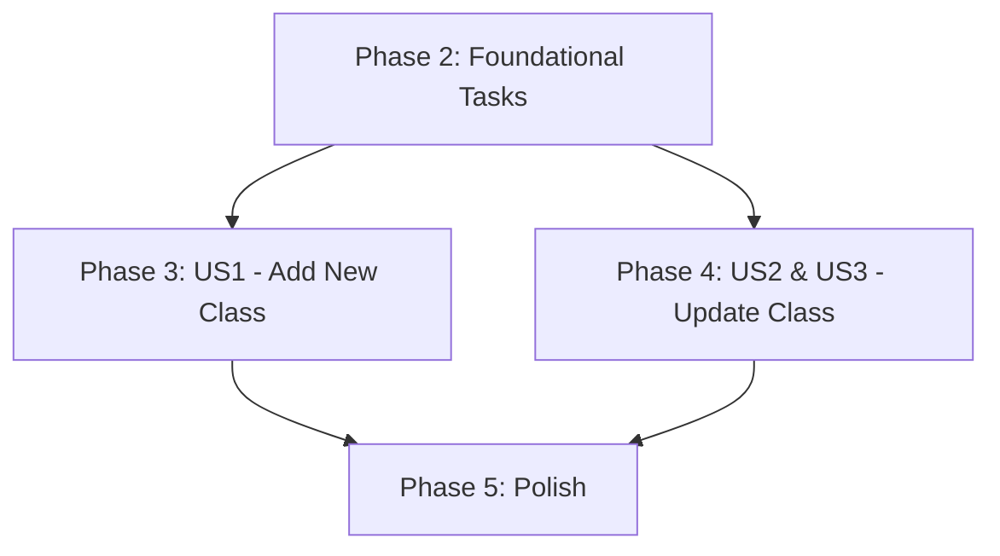

# Tasks: Class Management Feature

## Summary

This document outlines the tasks required to implement the Class Management feature, allowing teachers to add and update class information. The implementation will focus on creating a reusable Class Form, associated hooks, and integrating them into existing components like `ClassDetailPage` and `ClassStudentList`.

## Implementation Strategy

This feature will be implemented incrementally, prioritizing core functionalities first. Foundational tasks will establish the necessary data structures and API integration. User Story 1 (Add Class) will deliver the initial form and creation flow. User Story 2 and 3 (Update Class from List and Detail Views) will reuse and extend the form for update operations. Final polish and cross-cutting concerns will ensure a robust user experience.

## Dependencies

## Parallel Execution Opportunities

- Phase 2 tasks can be parallelized since they are logically separate file creations.
- Within Phase 3, the `ClassForm` creation and `createClass` API logic can be developed in parallel.
- Within Phase 4, `updateClass` API logic, `ClassForm` enhancement, and `UpdateClassModal` creation can be parallelized.

## Phase 1: Setup

No specific setup tasks required as the project environment is already configured.

## Phase 2: Foundational Tasks

- [x] T000 Create `/schemas/classSchema.ts` file for class validation schema.
- [x] T001 Define TypeScript interface for `Class` entity in `container/src/features/classes/types/entities/class.ts`.
- [x] T002 Define TypeScript interfaces for `ClassCreateRequest` and `ClassUpdateRequest` in `container/src/features/classes/types/requests/classRequests.ts`.
- [x] T003 Create a custom React hook `useClassForm` for form state management and validation in `container/src/features/classes/hooks/useClassForm.ts`.
- [x] T004 Create `service.ts` for API interactions (create, update) in `container/src/features/classes/api/service.ts` (implementation will be empty/placeholder).

## Phase 3: User Story 1 - Add a New Class (P1)

**Goal**: Allow teachers to add new class information via a modal.
**Independent Test Criteria**: Open "Add Class" modal, submit valid details, verify success message. Submit invalid details, verify error message.

- [x] T005 [US1] Create `ClassForm` component (reusable for create/update) in `container/src/features/classes/components/ClassForm.tsx`.
- [x] T006 [US1] Integrate `useClassForm` hook with `ClassForm` component for client-side validation in `container/src/features/classes/components/ClassForm.tsx`.
- [x] T007 [US1] Integrate `useClassForm` hook with `ClassForm` component for client-side validation in `container/src/features/classes/components/ClassForm.tsx`.
- [x] T008 [US1] Create `AddClassModal` component that renders `ClassForm` and handles `createClass` submission in `container/src/features/classes/components/AddClassModal.tsx`.
- [x] T009 [US1] Add "Create Class" button to `ClassDetailPage` (or relevant parent component) to open `AddClassModal` in `container/src/app/pages/ClassDetailPage.tsx`.

## Phase 4: User Story 2 - Update Class from List View (P1) & User Story 3 - Update Class from Detail View (P2)

**Goal**: Allow teachers to update existing class information from list and detail views via a modal.
**Independent Test Criteria**: 
- From List View: Click "Update" on a class, open pre-filled "Update Class" modal, submit valid updates, verify success.
- From Detail View: Click "Update" on detail page, open pre-filled "Update Class" modal, submit valid updates, verify success.

- [x] T010 [US2, US3] Implement `updateClass` logic within the `service.ts` utilizing the `PUT /api/classes/{classId}` endpoint in `container/src/features/classes/api/service.ts` (implementation will be empty/placeholder).
- [x] T011 [US2, US3] Enhance `ClassForm` to support pre-filling with existing class data for update operations in `container/src/features/classes/components/ClassForm.tsx`.
- [x] T012 [US2, US3] Create `UpdateClassModal` component that renders `ClassForm` with pre-filled data and handles `updateClass` submission in `container/src/features/classes/components/UpdateClassModal.tsx`
- [x] T013 [US2, US3] Add "Update" action button to `ClassStudentList` (or relevant list component) to open `UpdateClassModal` in `container/src/features/classes/components/ClassStudentList.tsx`.
- [x] T014 [US2, US3] Add "Update" button to `ClassDetailPage` to open `UpdateClassModal` for the current class in `container/src/app/pages/ClassDetailPage.tsx`.

## Phase 5: Polish & Cross-Cutting Concerns

- [x] T015 Implement proper loading indicators (e.g., spinners) for form submissions in `container/src/features/classes/components/ClassForm.tsx`.
- [x] T016 Implement error handling and display user-friendly error messages for API failures in `container/src/features/classes/api/service.ts` and `container/src/features/classes/components/ClassForm.tsx`.
- [x] T017 Integrate toast notifications for success/failure feedback after class creation/update in `container/src/features/classes/components/ClassForm.tsx` (or parent modals).